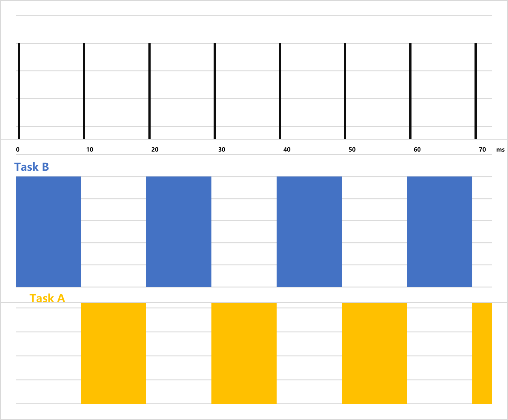
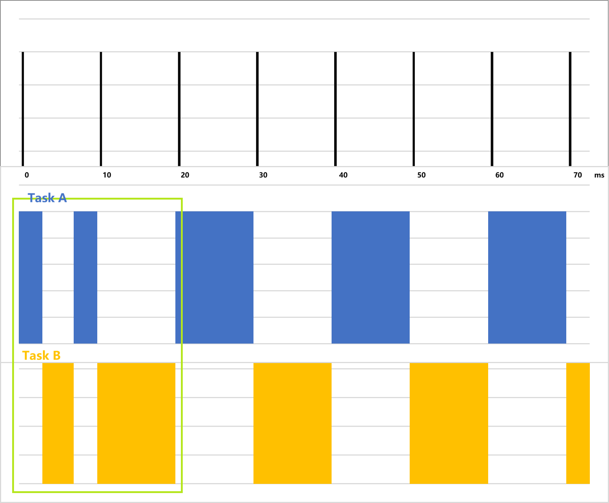
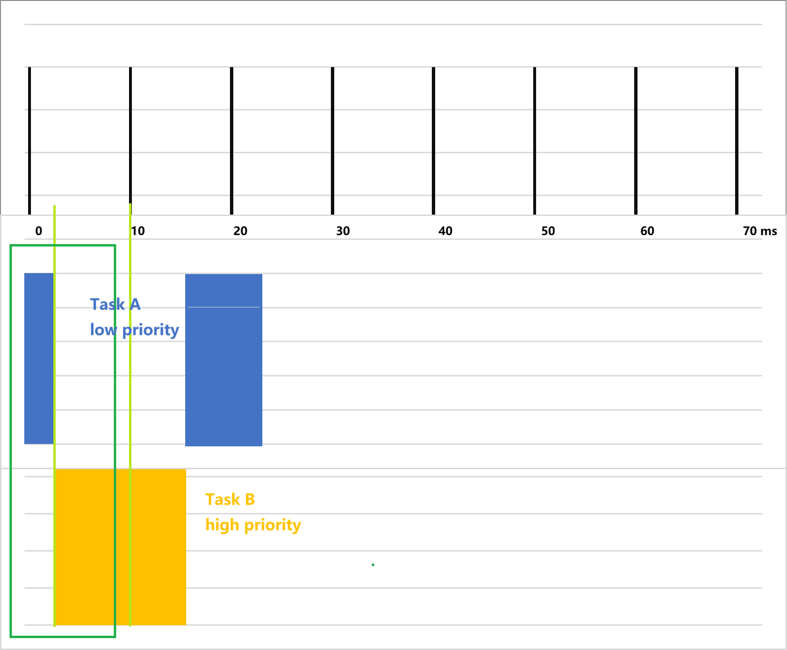

# Task调度

## 1. RTOS中的Task(Thread)

在 RTOS 中，Task（任务）或 Thread（线程）是最小的调度单位。每个 Task 都有自己的：

- **栈空间（Stack）**：用于保存局部变量和函数调用上下文。
- **优先级（Priority）**：决定任务获取 CPU 使用权的紧迫程度。
- **状态（State）**：通常包括运行、就绪、阻塞和挂起。

Task 通常被设计为一个无限循环，在循环中处理特定事务，并在没有工作时主动挂起（如等待信号量或延时），让出 CPU 给其他任务。

## 2. Task调度规则

### 2.1 什么是调度

调度（Scheduling）是 RTOS 内核的核心功能，它决定了在任意时刻，CPU 应该执行哪个 Task。调度器（Scheduler）会根据特定的算法（如基于优先级的抢占式调度）在多个 Task 之间切换 CPU 控制权，这个过程称为**上下文切换**（Context Switch）。

### 2.2 优先级对调度的影响

目前采用**基于优先级的抢占式调度，共7个优先级(0~6)，6为最高优先级**：

1. **高优先级抢占**：一旦有一个比当前运行任务优先级更高的任务进入就绪态，调度器会立即暂停当前任务，切换到高优先级任务执行。
2. **同优先级轮转**：如果支持时间片轮转，相同优先级的任务会轮流占用 CPU，每人执行一个时间片。
3. **空闲任务**：当所有应用任务都处于阻塞状态时，运行优先级最低的空闲任务（Idle Task）。

当前默认存在的高优先级task：SW timer(6)，Upperstack(6)， Lowerstack(6)。

当前默认存在的低优先级task：idle(0)。

## 2.3 调度规则

基本时间片10ms，每10ms检查一次task list。

### 2.3.1 同优先级调度

1. 正常调度，假设task A和task B同优先级(1)，没有pending（类似GUI线程）：
   
2. Task A到期后pending，转到taskB工作，B pending后转到Task A，无需等待时间片轮转:
   

### 2.3.1 高优先级抢占

高优先级的任务会在任意时刻抢占低优先级任务，无论当前任务是否到期（有lock的情况除外）。
   

### 2.3.1 低优先级排队

低优先级的任务会在没有更高优先级task处于active或ready状态时被调度。当系统所有任务都已进入pending状态时，idle task会被执行。且20ms内无高优先级task需要被执行时，系统可以进入DLPS状态。
从优先级上来说，可以概括为：当前正在调度运行的task，一定是优先级最高的task。所以开发者需要注意，如果有一个task长时间占据一个高优先级的位置，那么可能一些低优先级的task永远不会被执行到，产生系统风险。

### 2.3.1 进程锁

如果开发者希望某个低优先级任务在运行时不被抢占，那么可以在任务代码中添加锁（lock）。锁的方式可以通过互斥量来实现，如果低优先级的task持有某个互斥量不释放，则可以实现长时间占有时间片的效果。

### 2.3.2 释放task

释放task主要可以通过3种方式：

1. 主动进行suspend，在开发者明确定义状态机的情况下，可以直接挂起任务来释放资源。
2. 调用delay接口。
3. 使用os提供的等待消息接口，没有收到消息时任务都会被pending。

## 3. 多Task对UI显示的影响

在UI系统中，Task 的调度直接关系到显示的流畅度（FPS）和交互的响应速度。

### 3.1 UI 任务的优先级

- **过低**：如果 UI 渲染任务优先级低于大量的数据处理或网络任务，UI 线程容易被抢占，导致界面卡顿、触控滞后。
- **过高**：如果 UI 任务优先级过高且占用大量 CPU（例如软件渲染复杂动画），可能会阻塞触摸输入处理或关键的后台业务逻辑，导致“点击无反应”或数据更新滞后。

### 3.2 资源竞争与同步

UI 系统通常需要大量的内存访问，如果多个 Task或多个master共同访问这些内存，会导致显示撕裂、花屏，甚至内存错误。当前处理方式是将所有绘图放在唯一的 UI 任务中，逐步串行处理，避免访问冲突。

### 3.3 在 UI 线程中执行的耗时操作

UI 线程的核心职责是绘制和响应，目前的耗时操作包括：

- 数据读写（I/O 阻塞）
  - 图像数据的解压
  - 图像绘制
  - 显示推屏
- 复杂的浮点运算
  - 3D图形
  - 矩阵运算
  - 矢量绘制

### 3.4 需要改进的点

#### 3.4.1 优先级

考虑应用与UI的优先级，需要考虑应用的状态变化，也要考虑UI的刷新率。目前现成的问题是：Nippon Seiki使用英飞凌的芯片在CPU占用率50%时，刷新性能已不足30 FPS，且英飞凌的芯片整体性能不弱。

#### 3.4.2 调度方式

目前UI task的逻辑是无限循环，若无控件改动，会通过delay去释放一些资源。可以考虑是否通过消息机制，通过定时器等激活刷新。
