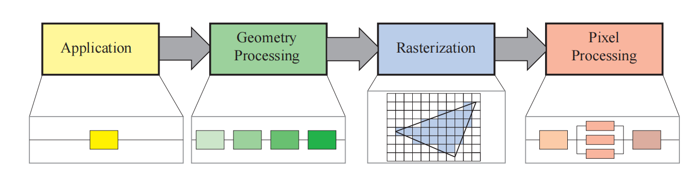
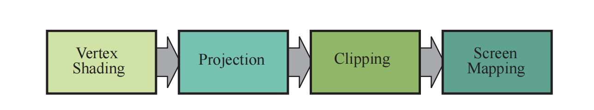
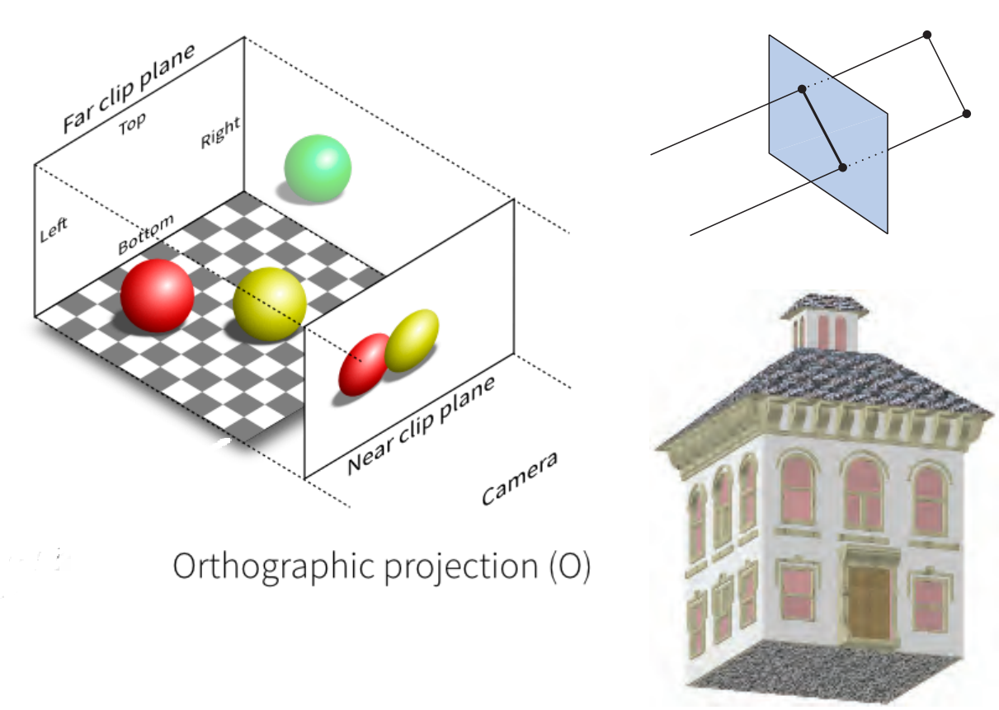
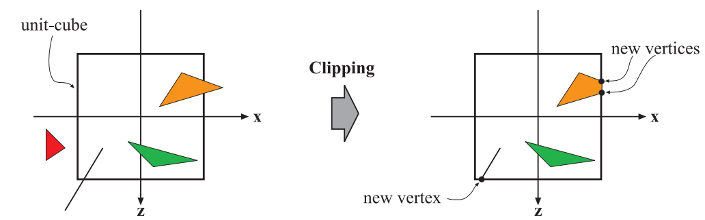
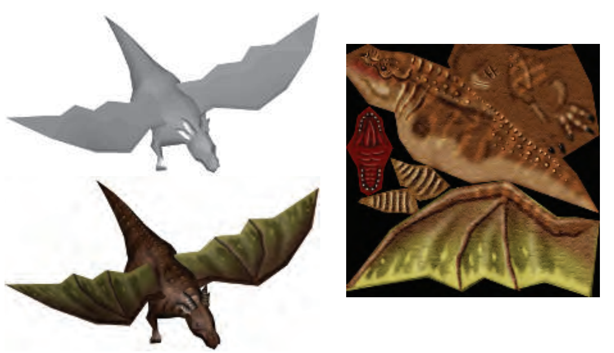
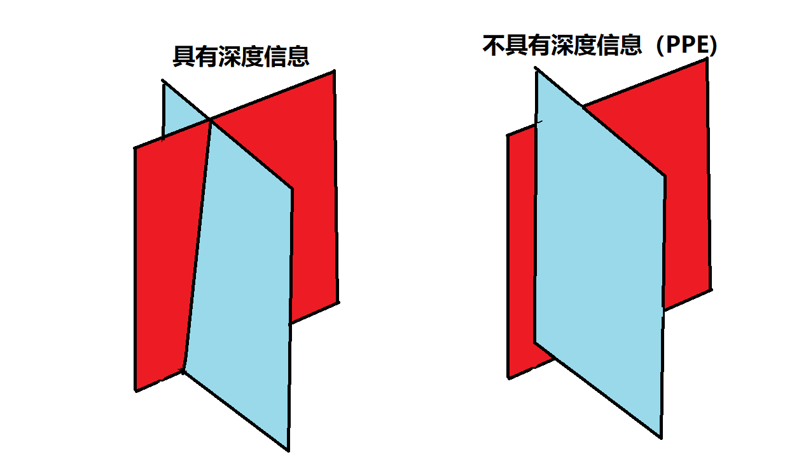

# 3D GPU 概述

## 1. 什么是 3D GPU

3D GPU（图形处理单元）是一种专门设计用于加速计算机图形和图像处理的硬件组件。与传统的 2D 或 2.5D GPU 不同，3D GPU 能够渲染具有深度感、光照效果和材质细节的真实三维场景。

### 1.1 3D GPU 的核心价值

- **真实感渲染**：支持光照、阴影、材质和纹理等高级视觉效果
- **可编程性**：通过着色器程序实现高度灵活的图形处理
- **高性能**：并行架构设计，可处理数百万个三角形和像素
- **通用计算能力**：支持 OpenCL、CUDA 等通用计算 API

## 2. 3D GPU 主要应用领域

### 2.1 嵌入式系统

- **车载信息娱乐系统**：3D 导航、仪表盘、多媒体界面
- **智能家居设备**：智能电视 UI、家庭控制中心
- **工业自动化**：3D 可视化监控、控制面板
- **医疗设备**：3D 医学图像显示、手术导航

### 2.2 消费电子产品

- **智能手机/平板**：3D 游戏、AR/VR 应用
- **可穿戴设备**：智能手表 3D 界面、健康监测可视化
- **增强现实设备**：实时 3D 叠加显示

## 3. 3D GPU 核心技术

GPU的数据处理流程主要包括以下几个阶段：

用户应用中设计了需要GPU进行的工作，简单划分可以分为几何关系处理、光栅化以及像素处理。

### 3.1 几何关系处理

几何处理并不仅仅是GPU的任务，其中也有一部分是CPU的任务。CPU主要负责上层/宏观的几何关系，例如场景设计、动画逻辑等；而GPU则负责算力需求更高、逻辑相对固定的任务，包含顶点运算、投影、裁切和映射等。

#### 3.1.1 顶点处理
在GPU的处理中，最先输入的往往是一系列的顶点信息，包含一组多边形的顶点位置、颜色、纹理、法线等信息，这些信息一般放置在第一个顶点处。一般来说常见的顶点组成的多边形是三角形和四边形等，如下图所示，是由四边形和三角形构成的3D模型。

一般来说，三角形更为常见，因为它们是基本的多边形，其他多边形可以通过三角形组合而成，四边形可以拆分为两个三角形。同时，三角形的内外计算也更为简单，有助于降低数据量、简化电路。

##### 可编程顶点着色器
传统的顶点着色器固定计算顶点位置、法向量与经过光照效果后的颜色值，而在现代GPU中，顶点着色器(vertex shader)往往是可编程的，OpenGL ES、Vulkan等图形API都支持顶点着色器的编程。以一个phong模型为例：

通过改变其中的参数，可以实现不同的光照效果，例如环境光、漫反射、镜面反射等。对比传统的固定管线着色器，顶点着色器的编程性使得GPU能够更灵活地处理复杂的几何关系和光照效果。

##### 顶点变换
在顶点着色器中，往往输入已经确定了顶点的基本位置，例如位置、法向量、纹理坐标等。着色器需要根据这些信息计算出顶点在空间中经过变换之后的位置，这些都可以通过齐次坐标系下的矩阵乘法实现，包括平移、缩放、旋转等。下面这个例子描述了传统刚体变换与顶点变换的区别：
刚体变换缺少顶点间的相对位置，而顶点变换则能够保留顶点之间的相对位置。这允许3D模型实现更灵活、复杂和真实的模型效果。

##### 视图变换
在顶点着色器中，一般数学上会将相机放置在原点，上方与y轴正方向重合，相机的视图方向与z轴负方向重合，这是由传统的右手坐标系决定的。但是在OpenGL等图形API中，相机视点指向Z轴正方向，改为采用左手坐标系，虽然与传统的右手坐标系习惯相悖，但是这样也带来了运算上的便利：更远面F，在Z方向的数值上总是小于更近的面N。在顶点着色阶段，相机往往会被变换到上述位置，用于简化后续处理，如下图所示，需要将t向量旋转至y向量重合，e向量旋转至x向量重合，g旋转至-z向量重合（OpenGL相反）。这个变换一般称为view transform，即视图变换。视图变换并不会影响到模型自身的成像效果：

#### 3.1.2 投影变换
投影变换实际有一部分在定点着色器中完成，即对模型乘以投影矩阵。投影矩阵一般有两种：正交投影矩阵（orthographic projection）和透视投影矩阵（perspective projection）。透视投影，指的是包含深度
信息的投影变换，具备远小近大的特征，如下图所示：

正交投影可以视作一个视点(camera)离物体和投影面无限远的投影变换，从而使物体投影到投影面上不会产生变化。

在投影变换阶段，GPU工作的目的是将视椎体（Frustum）压缩到单位立方体中已被后续裁剪和屏幕映射使用。需要注意的是，这里实际只做了矩阵运算，并没有真正地进行像素处理：

#### 3.1.3 裁剪
裁剪阶段将超出投影区域(单位立方体)的部分进行丢弃，只保留在投影区域内内的多边形。

#### 3.1.4 屏幕映射
屏幕映射也是一个矩阵运算的阶段，它将作为投影面的单位立方体[-1, 1]拉伸到实际屏幕宽度[w, h]。

### 3.2 光栅化阶段
在这个阶段，硬件是固定管线，不可编程，主要负责扫描三角形数据的准备和遍历。

#### 3.2.1 三角形准备

在此阶段，GPU进行上一阶段送入的全部三角形和矩阵变换，将顶点位置、法向量、纹理坐标等信息进行变换，从而得到三角形的边等式(edge equation)、各方向梯度(differential)。这些数据用于后一步三角形遍历以及后续的像素插值等工作。
- 三角形的边等式(edge equation)：用于判断点是否在三角形内。
- 各方向梯度(differential)：遍历像素时使用，同时用于插值（双线性、三线性、各向异性）。

#### 3.2.2 三角形遍历

在3.2.1 三角形准备阶段，GPU会根据三角形的边等式(edge equation)，逐像素判断是否在三角形内，或利用2×2/4×4/8×8等大小的像素块进行快速的提出大块的三角形外区域。同时，这一阶段会进行插值并生成片段(fragment)，包含坐标、深度、颜色、法向量等，形成一系列的片段后传递给下一阶段的片段着色器(fragment shader)。

### 3.3 像素处理

在此阶段，GPU需要进行片段着色与合成,完成最后的输出。

#### 3.3.1 片段着色
片段着色，也叫做像素着色，此阶段是可编程管线，开发者可以决定处理像素的方式。从这一角度来说，PPE也拥有一个可配置的着色器，通过设定不同的混合公式，可以实现不同的像素处理效果。处理的是3.2.2中处理完的片段(fragment)，根据片段提供的信息，进行纹理映射、光照计算、RGB填充和深度测试等操作。其中：
- 纹理映射：根据片段的纹理坐标，从纹理贴图中采样颜色值。
- 光照计算：根据片段的法向量和环境光、漫反射、镜面反射等信息计算出的光照效果，计算出最终的颜色值。
- RGB填充：经过插值后的颜色值，填充到对应的像素中。如果经过了MSAA等操作，还需要进行采样合并。
- 深度测试：根据片段的深度值和当前像素的深度值，判断是否需要更新当前像素的深度值。

一个典型纹理映射案例如下所示，左上角为原始模型经过顶点着色器后的变化效果，右侧为用于采样的纹理贴图，左下角为贴图后的效果：

#### 3.3.2 合成像素
每个像素的信息被保存在颜色缓冲（color buffer）中——这是一个矩形的颜色数组，一般与传统的frame buffer相同，每个颜色含红、绿、蓝三个分量。合并阶段的责任是把像素着色阶段产生的片段颜色与当前缓冲中已有的颜色结合起来。
在Merge阶段，GPU也需要同时负责解决可见问题。在片段着色器处理完成后，除了颜色值，还会提供深度值。每个片段的深度信息会与当前color buffer的中颜色对应的深度进行比较，这些深度值存储在z-buffer中，每个像素保存当前最近图元的 z 值。当新的图元要写入某像素时，先计算该图元在此像素的 z 值并与 z-buffer 中的值比较。若新 z 更小，则新图元更近，于是同时更新 z-buffer 与颜色缓冲。深度缓冲的有点是允许几何面以任意顺序处理，不会存在前后冲突。而PPE则只具备平面处理能力，无法处理面交叠的情况。如下图所示：

需要注意的是，z-buffer 每点只存一个深度，无法处理部分透明图元。这些图元必须在所有不透明图元之后按“从后向前”顺序渲染。透明度是基本 z-buffer 的主要弱点之一。

### 3.4 主要图形 API

- **OpenGL ES**：嵌入式系统的 3D 图形标准
- **Vulkan**：现代低开销 3D API
- **DirectX**：Windows 平台的图形 API
- **Metal**：Apple 平台的图形 API
